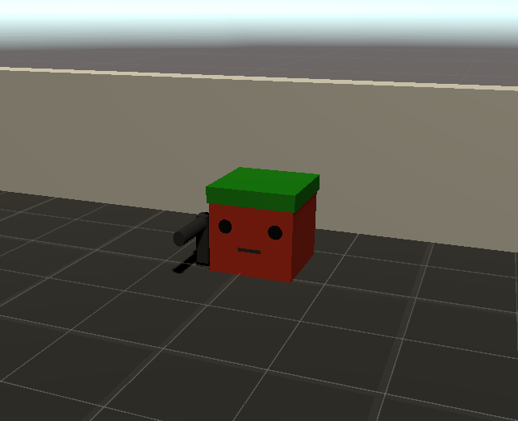

# Лабораторная 3. Шутер

Обучите агентов играть в шутер.

В заготовке реализована стрельба рейкастом и базовое управление (WASDQE, Space). Можно редактировать всё при сохранении смысла задания, в том числе не использовать заготовку.

У каждого агента по 3 хп, уровень начинается заного после смерти всех членов команды или по времени (правила могут быть изменены по усмотрению студента с оглядкой на здравый смысл).

## Задание
### Основные баллы (10)
Для зачёта нужно, чтобы агенты играли сильнее преподавателя.
1. [5 баллов] Обучите агентов играть друг против друга в шутер, используя self-playing.
2. [5 баллов] Сделайте это командой на команду с использованием MA-POCA и групп. Попробуйте поиграть в составе одной из команд.

### Бонусные баллы
1. [+5 баллов] Добавьте какую-нибудь механику (например, второй вид оружия, патроны, аптечки, захват флага, см. шутеры). Для получния баллов студентом, агенты должны научиться ей пользоваться.
4. [+5 баллов] За вторую, отличную от первой механику или заметное (логичное с точки зрения геймдизайна) изменение карты/создание набора карт.